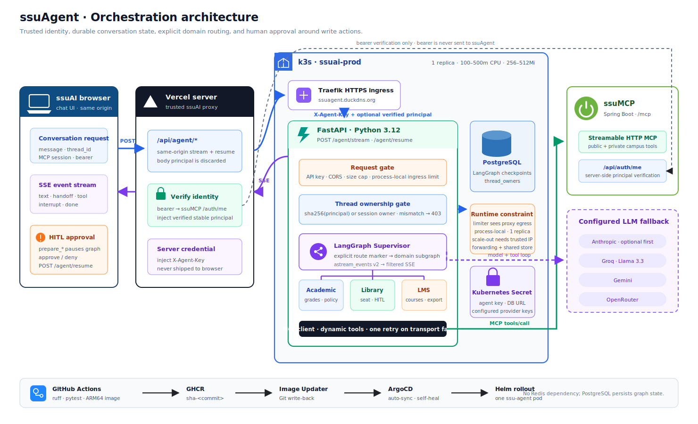

# ssuAgent 아키텍처

> ssuAgent는 ssuAI와 ssuMCP 사이의 대화 오케스트레이션 계층이다. 학교 데이터와 write action의 최종 계약은 [ssuMCP](https://github.com/ghdtjdwn/ssuMCP)가 소유한다.

## 전체 구성

[PNG 버전](assets/architecture.png)

## 요청과 신뢰 경계

브라우저는 ssuAgent ingress를 직접 호출하지 않고 ssuAI의 same-origin `/api/agent/{stream,resume}`를 사용한다. Vercel의 server-side proxy는 다음 순서를 지킨다.

1. 브라우저 request body의 `principal`을 항상 제거한다.
2. Bearer token이 있으면 ssuMCP `/api/auth/me`에서 subject를 검증하고 그 결과만 `principal`로 주입한다. Bearer token 자체는 ssuAgent로 전달하지 않는다.
3. 서버 전용 `X-Agent-Key`를 주입한다. 운영 ssuAgent는 키가 없으면 시작을 거부하고 요청마다 constant-time 비교를 수행한다.
4. FastAPI는 CORS, payload 크기, process-local ingress rate limit를 검사한 뒤 `thread_id` 소유권을 검증한다. 현행 Vercel proxy는 검증된 browser client IP를 별도 header로 전달하지 않으므로 이 limiter key는 실제 최종 사용자보다 proxy egress 경계에 가깝다.

검증된 principal은 SHA-256 digest로 `thread_owners`에 저장된다. 같은 principal은 MCP session이 회전해도 thread를 이어가지만 다른 principal이나 승격 후 principal이 없는 요청은 403을 받는다([ADR 0010](adr/0010-agent-thread-ownership-binding.md), [ADR 0011](adr/0011-thread-stable-principal-binding.md)).

## Graph와 상태

FastAPI lifespan이 PostgreSQL connection pool, LangGraph `AsyncPostgresSaver`, `thread_owners`, supervisor graph를 초기화한다. `thread_id`는 checkpoint key이고 `mcp_session_id`는 ssuMCP private tool 권한이다. 두 값은 독립적으로 수명과 목적이 다르다.

Supervisor는 공개 campus 도구를 직접 처리하거나 route marker를 통해 Academic, Library, LMS subgraph로 전환한다. 각 subgraph는 동적으로 로드한 MCP 도구를 사용하며 transport 종료·일시적 502/503/504에는 한 번만 재연결해 재시도한다. 모델에는 MCP session 원문과 내부 인증 안내를 노출하지 않는다.

LLM sequence는 설정된 provider만 Anthropic(선택) → Groq → Gemini → OpenRouter 순서로 구성한다. agent의 수동 tool loop가 provider 실패 시 다음 모델로 넘어가며, 모든 키가 없으면 시작 가능한 agent를 만들지 않고 명시적으로 실패한다([ADR 0015](adr/0015-optional-anthropic-provider.md)).

## SSE와 HITL

`/agent/stream`과 `/agent/resume`은 LangGraph `astream_events(version="v2")`를 사용자용 event로 정제한다. 모델 내부 state나 credential-bearing chunk는 버리고 `text`, `handoff`, `tool`, `interrupt`, `done`, `error`만 SSE로 보낸다.

Library write는 `prepare_*` 단계에서 LangGraph `interrupt()`로 멈춘다. checkpoint가 PostgreSQL에 남아 있으므로 pod process의 call stack에 의존하지 않는다. 브라우저가 승인 또는 거절을 `/agent/resume`으로 보내면 동일한 owner와 thread를 다시 검증한 뒤 `Command(resume=...)`로 graph를 이어간다. 실제 write는 승인된 `confirm_action`에서만 ssuMCP가 수행한다.

## 배포와 운영 제약

GitHub Actions는 Ruff와 pytest를 통과한 main commit을 ARM64 image로 GHCR에 게시한다. ArgoCD Image Updater가 SHA tag를 `deploy/charts/ssu-agent/values.yaml`에 write-back하고 ArgoCD가 `ssuai-prod` namespace에 자동 sync한다.

현재 production은 1 replica이고 SlowAPI rate limit는 process memory에 있다. ssuAI proxy가 원본 browser IP를 전달하지 않아 여러 사용자가 같은 Vercel egress bucket을 공유할 수 있으며, direct ingress에서 임의의 `X-Forwarded-For`를 사용자 identity로 신뢰해서도 안 된다. replica를 늘리거나 사용자별 quota가 필요해지면 Vercel이 검증해 서명한 client identity/IP 전달, Traefik trusted-hop 규칙, shared rate-limit store를 함께 설계해야 한다. 대화 state와 owner binding은 이미 PostgreSQL에 있어 pod restart에는 독립적이다. 자세한 배포 검증은 [deploy.md](deploy.md)를 따른다.
