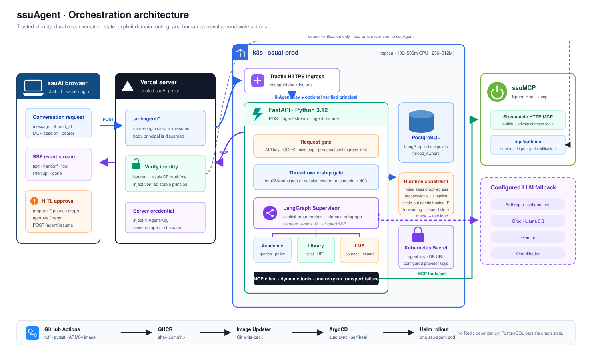

# ssuAgent 아키텍처

> ssuAgent는 ssuAI와 ssuMCP 사이의 대화 오케스트레이션 계층이다. 학교 데이터와 write action의 최종 계약은 [ssuMCP](https://github.com/ghdtjdwn/ssuMCP)가 소유한다.

## 전체 구성

[PNG 버전](assets/architecture.png)

## 요청과 신뢰 경계

브라우저는 ssuAgent ingress를 직접 호출하지 않고 ssuAI의 same-origin `/api/agent/{stream,resume}`를 사용한다. Vercel의 server-side proxy는 다음 순서를 지킨다.

1. 브라우저 request body의 `principal`을 항상 제거한다.
2. Bearer token이 있으면 ssuMCP `/api/auth/me`에서 subject를 검증하고 그 결과만 `principal`로 주입한다. Bearer token 자체는 ssuAgent로 전달하지 않는다.
3. 서버 전용 `X-Agent-Key`를 주입한다. 운영 ssuAgent는 키가 없으면 시작을 거부하고 요청마다 constant-time 비교를 수행한다.
4. proxy는 검증된 principal 또는 Vercel의 spoof 방지 client IP를 pseudonym으로 만들고 HMAC 서명한다. FastAPI는 서명을 검증한 identity로 process-local rate-limit bucket을 나눈 뒤 CORS, 32 KiB body, identifier pattern과 `thread_id` 소유권을 검사한다. 서명이 없거나 틀린 direct traffic은 `X-Forwarded-For`를 무시하고 socket bucket으로 제한한다.

검증된 principal은 SHA-256 digest로 `thread_owners`에 저장된다. 같은 principal은 MCP session이 회전해도 thread를 이어가지만 다른 principal이나 승격 후 principal이 없는 요청은 403을 받는다([ADR 0010](adr/0010-agent-thread-ownership-binding.md), [ADR 0011](adr/0011-thread-stable-principal-binding.md)).

## Graph와 상태

FastAPI lifespan이 PostgreSQL connection pool, LangGraph `AsyncPostgresSaver`, `thread_owners`, supervisor graph를 초기화한다. startup은 배포 전 checkpoint의 legacy `mcp_session_id` channel만 bounded batch로 `None` 치환하고, owner row lock을 사용하는 checkpoint lifecycle fence를 세 saver table에 설치한다. scrub, delete, retention, saver write는 모두 owner → checkpoint lock order를 사용하고 여러 owner는 `thread_id` 순서로 잡는다. `thread_id`는 checkpoint key이고 `mcp_session_id`는 ssuMCP private tool 권한이다. live capability는 request-scoped `ContextVar`에만 바인딩하고 legacy state channel에는 `None`을 써서 HITL checkpoint에 재사용 가능한 bearer를 남기지 않는다. 재로그인과 resume은 매 request의 최신 capability를 사용한다.

Supervisor는 공개 campus 도구를 직접 처리하거나 route marker를 통해 Academic, Library, LMS subgraph로 전환한다. 각 subgraph는 동적으로 로드한 MCP 도구를 사용하며 transport 종료·일시적 502/503/504에는 한 번만 재연결해 재시도한다. 모델에는 MCP session 원문과 내부 인증 안내를 노출하지 않는다.

LLM sequence는 설정된 provider만 Anthropic(선택) → Groq → Gemini → OpenRouter 순서로 구성한다. agent의 수동 tool loop가 provider 실패 시 다음 모델로 넘어가며, 모든 키가 없으면 시작 가능한 agent를 만들지 않고 명시적으로 실패한다([ADR 0015](adr/0015-optional-anthropic-provider.md)).

## SSE와 HITL

`/agent/stream`과 `/agent/resume`은 LangGraph `astream_events(version="v2")`를 사용자용 event로 정제한다. 모델 내부 state나 credential-bearing chunk는 버리고 `text`, `handoff`, `tool`, `interrupt`, `done`, `error`만 SSE로 보낸다.

Library write는 `prepare_*` 단계에서 LangGraph `interrupt()`로 멈춘다. checkpoint가 PostgreSQL에 남아 있으므로 pod process의 call stack에 의존하지 않는다. 브라우저가 승인 또는 거절을 `/agent/resume`으로 보내면 동일한 owner와 thread를 다시 검증한 뒤 `Command(resume=...)`로 graph를 이어간다. 실제 write는 승인된 `confirm_action`에서만 ssuMCP가 수행한다.

## 배포와 운영 제약

GitHub Actions는 Ruff와 pytest를 통과한 main commit을 ARM64 image로 GHCR에 게시한다. ArgoCD Image Updater가 SHA tag를 `deploy/charts/ssu-agent/values.yaml`에 write-back하고 ArgoCD가 `ssuai-prod` namespace에 자동 sync한다.

현재 production은 1 replica이고 SlowAPI counter는 process memory에 있다. signed identity로 Vercel egress 공유 문제는 제거했지만 replica를 늘리면 pod마다 quota가 따로 계산된다. 기존 PostgreSQL은 checkpoint용이며 hot-path limiter storage로 검증되지 않았으므로 이번 변경에서 억지로 재사용하지 않았다. scale-out 전 Redis 같은 shared limiter와 failure policy를 별도 검증해야 한다. `/health`는 shallow liveness, `/ready`는 bounded PostgreSQL/checkpointer readiness, `/healthz/deep`은 MCP 진단이다. 대화는 owner 검증 DELETE와 마지막 접근 기준 bounded retention으로 제거하며, DB fence가 DELETE commit 뒤 late checkpoint 재생성을 막는다([ADR 0023](adr/0023-conversation-lifecycle-and-edge-identity.md)).
